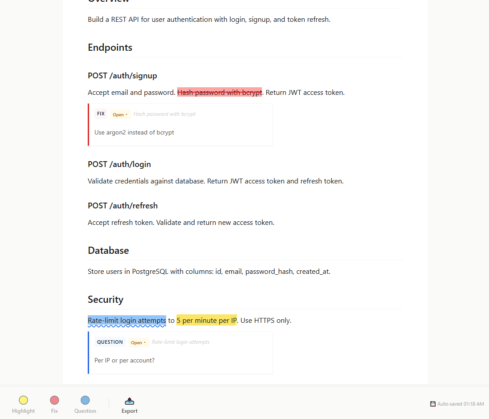

# MD Feedback

Review a plan before your AI agent implements it. Annotate markdown with highlights, fixes, and questions — then export as context your agent actually reads.


[](https://buymeacoffee.com/ymnseon8)



## Why

You write a plan in markdown. Your AI agent implements it. But the agent doesn't know which parts you've reviewed, what you want changed, or what questions remain.

MD Feedback bridges that gap. You annotate the plan with highlights, fixes, and questions. Each annotation carries structured metadata — type, status, owner. When you export, the result is a file your AI tool auto-loads (like `CLAUDE.md` or `.cursor/rules/`) plus a ready-to-paste prompt copied to your clipboard.

The agent gets structured instructions it can act on. You stay in control.

## Quick Start

1. Install from the [VS Code Marketplace](https://marketplace.visualstudio.com/items?itemName=yeominux.md-feedback)
2. Click the **MD Feedback** icon in the Activity Bar (left sidebar)
3. Open any `.md` file — it loads in the sidebar panel
4. Select text, press `1` (highlight), `2` (fix), or `3` (question)
5. Export via the toolbar — the result is saved to the tool's config file **and** copied to your clipboard as a ready-to-paste prompt

## Features

- **3 annotation types**: Highlight (yellow), Fix (red strikethrough + memo), Question (blue underline + memo)
- **Export to 13 targets**: 9 AI tool-specific formats + Generic Markdown + Handoff Document, plus Export All (batch) and the QuickPick picker. Each export saves the file **and** copies a ready-to-paste prompt to your clipboard.
- **Memo status tracking**: Every memo has a status (`open` / `answered` / `done` / `wontfix`) and owner (`human` / `agent`)
- **Checkpoints**: Save review progress snapshots — manually via Command Palette, or let the MCP server create them
- **Session handoff**: Generate structured `HANDOFF.md` documents so the next session knows exactly where you left off

<details>
<summary>More features</summary>

- **Gates**: Define merge/release/implement conditions that auto-evaluate based on memo states
- **Plan cursor**: Track "where we are" in a plan — agents update position, the sidebar displays it
- **Status summary bar**: Live count of open fixes, open questions, and gate status
- **Export All**: One click writes context files for all 9 AI tool-specific targets at once (Claude Code, Cursor, Codex, Copilot, Cline, Windsurf, Roo Code, Gemini, Antigravity)
- **Clipboard + prompt**: Every individual export copies a ready-to-paste prompt to your clipboard: *"I reviewed [file] and annotated it with MD Feedback. Here are the changes and questions. Implement the fixes and answer the questions:"* followed by the full export content
- **Git-friendly**: Annotations stored as `<!-- USER_MEMO -->` HTML comments in the `.md` file — no sidecar files, no databases
- **Keyboard-first**: All annotation actions accessible via keyboard shortcuts

</details>

### Supported AI Tools

| Tool | Config File | Auto-loaded |
|------|------------|-------------|
| Claude Code | `CLAUDE.md` | Yes — Claude Code CLI reads it automatically |
| Cursor | `.cursor/rules/plan-review.mdc` | Yes — Cursor AI loads rules automatically |
| OpenAI Codex | `AGENTS.md` | Yes — Codex CLI reads it automatically |
| GitHub Copilot | `.github/copilot-instructions.md` | Yes — Copilot Chat reads it automatically |
| Cline | `.clinerules` | Yes — Cline extension reads it automatically |
| Windsurf | `.windsurfrules` | Yes — Windsurf Cascade reads it automatically |
| Roo Code | `.roo/rules/plan-review.md` | Yes — Roo Code reads it in Code mode |
| Gemini | `.gemini/styleguide.md` | Yes — Gemini Code Assist reads it automatically |
| Antigravity | `.agent/rules/plan-review.md` | Yes — Google Antigravity reads it automatically |
| Generic | Timestamped `.md` file | Works with any tool (OpenCode, Aider, Lovable, etc.) |
| Handoff | `HANDOFF.md` | Session continuity document for any agent |

---

## MCP Server

Optional MCP server that lets AI agents read and update your review directly — no copy-paste needed.

**Without MCP**, you export annotations to a file, tell the agent to read it, then manually update memo status after each task. **With MCP**, the agent reads your annotations, implements fixes, marks them done, and evaluates gates on its own. You review the results instead of relaying messages.

```
You annotate plan.md
        |
AI reads annotations via MCP    <-- no export step
        |
AI implements fix
        |
AI marks memo "done" via MCP    <-- no manual status update
        |
AI evaluates gates --> "ready to merge"
```

### Setup

Add to your MCP client config (Claude Code, Cursor, etc.):

```json
{
  "mcpServers": {
    "md-feedback": {
      "command": "node",
      "args": ["/path/to/dist/mcp-server.js"]
    }
  }
}
```

Requires Node.js 18+.

<details>
<summary>11 MCP tools</summary>

| Tool | Description |
|------|-------------|
| `get_document_structure` | Full review state: memos, gates, cursor, sections, summary |
| `list_annotations` | All annotations with type/status/owner/color |
| `get_review_status` | Annotation counts and session status |
| `update_memo_status` | Mark a memo as open/answered/done/wontfix |
| `update_cursor` | Set plan cursor position (task ID, step, next action) |
| `evaluate_gates` | Check if merge/release/implement conditions are met |
| `export_review` | Export for a specific AI tool format |
| `create_checkpoint` | Save review progress |
| `get_checkpoints` | List all checkpoints |
| `generate_handoff` | Generate structured handoff document |
| `pickup_handoff` | Parse existing handoff for session resumption |

</details>

---

<details>
<summary>Commands</summary>

All commands available via Command Palette (`Ctrl+Shift+P` / `Cmd+Shift+P`):

| Command | Description |
|---------|-------------|
| `MD Feedback: Create Checkpoint` | Save review progress checkpoint |
| `MD Feedback: Export: All Tools` | Write all 9 AI tool context files at once |
| `MD Feedback: Export: Claude Code` | `CLAUDE.md` — auto-loaded by Claude Code CLI |
| `MD Feedback: Export: Cursor` | `.cursor/rules/plan-review.mdc` — auto-loaded by Cursor |
| `MD Feedback: Export: Codex` | `AGENTS.md` — auto-loaded by OpenAI Codex CLI |
| `MD Feedback: Export: GitHub Copilot` | `.github/copilot-instructions.md` — auto-loaded by Copilot Chat |
| `MD Feedback: Export: Cline` | `.clinerules` — auto-loaded by Cline extension |
| `MD Feedback: Export: Windsurf` | `.windsurfrules` — auto-loaded by Windsurf Cascade |
| `MD Feedback: Export: Roo Code` | `.roo/rules/plan-review.md` — auto-loaded by Roo Code |
| `MD Feedback: Export: Gemini` | `.gemini/styleguide.md` — auto-loaded by Gemini Code Assist |
| `MD Feedback: Export: Antigravity` | `.agent/rules/plan-review.md` — auto-loaded by Google Antigravity |
| `MD Feedback: Export: Generic Markdown` | Clipboard + timestamped file — works with any AI tool |
| `MD Feedback: Export: Handoff Document` | `HANDOFF.md` — session handoff for continuity |

Each individual export (not Export All) also copies the content to your clipboard wrapped in a ready-to-paste prompt.

</details>

<details>
<summary>Keyboard Shortcuts</summary>

All shortcuts work inside the sidebar panel:

| Shortcut | Action |
|----------|--------|
| `1` | Highlight selected text (yellow) |
| `2` | Mark as Fix (red strikethrough + memo card) |
| `3` | Mark as Question (blue underline + memo card) |
| `Enter` | Save memo |
| `Esc` | Cancel memo |
| Click annotation | Remove it |

</details>

<details>
<summary>State Model</summary>

Annotations carry structured metadata:

```html
<!-- USER_MEMO id="abc123" color="red" status="done" : Use OAuth2 instead of JWT -->
```

| Field | Values | Description |
|-------|--------|-------------|
| `status` | `open` / `answered` / `done` / `wontfix` | Workflow state |
| `type` | `fix` / `question` / `highlight` | Derived from color |
| `owner` | `human` / `agent` / `tool` | Who is responsible |

Gates define completion conditions:

```html
<!-- GATE
  id="gate-1"
  type="merge"
  status="blocked"
  blockedBy="memo-abc,memo-def"
  doneDefinition="No open fix memos remain"
-->
```

Plan cursor tracks progress:

```html
<!-- PLAN_CURSOR
  taskId="task-5"
  step="3/7"
  nextAction="Implement database migration"
-->
```

</details>

<details>
<summary>Export Format Examples</summary>

**Claude Code (CLAUDE.md)**

```markdown
## Active Plan Review: docs/plan.md
Follow this plan. Refer to docs/plan.md for details.

### Must Fix
- "authentication should use JWT" (Security) → Use OAuth2 instead

### Open Questions (resolve before implementing)
- "database schema" (Architecture) — PostgreSQL or SQLite?

### Checklist
- [ ] Endpoints
- [ ] Database

When all items are complete, delete this section.
```

**Cursor (.cursor/rules/plan-review.mdc)**

```markdown
---
description: Plan review feedback for Architecture Plan
alwaysApply: true
---
Follow the plan at docs/plan.md strictly.

Required changes:
- "authentication should use JWT" → Use OAuth2 instead

Open questions (resolve before coding):
- PostgreSQL or SQLite?

Remove this file when all items are complete.
```

**Handoff Document (HANDOFF.md)**

```markdown
# HANDOFF — docs/plan.md

## Session
- File: docs/plan.md
- Checkpoints: 3
- Annotations: 5 fix, 3 question, 8 highlight

## Decisions Made (5)
1. [Architecture] "Use REST instead of GraphQL" — simpler for MVP

## Open Questions (3)
1. [Security] "JWT vs session tokens?" — which has better DX?

## Next Steps
- [ ] Resolve: JWT vs session tokens
- [ ] Review uncovered: Deployment section
```

</details>

---

## Requirements

- **VS Code** 1.85.0 or later
- No external dependencies, accounts, or API keys
- **MCP server** (optional): Node.js 18+

## Contributing

[Open an issue](https://github.com/seonyeomin-rgb/md-feedback/issues) for bug reports or feature requests.

## License

MIT

---

<p align="center">
  <a href="https://buymeacoffee.com/ymnseon8">
    
  </a>
</p>
<p align="center">
  <sub>If MD Feedback saves you time, consider buying me a coffee!</sub>
</p>
